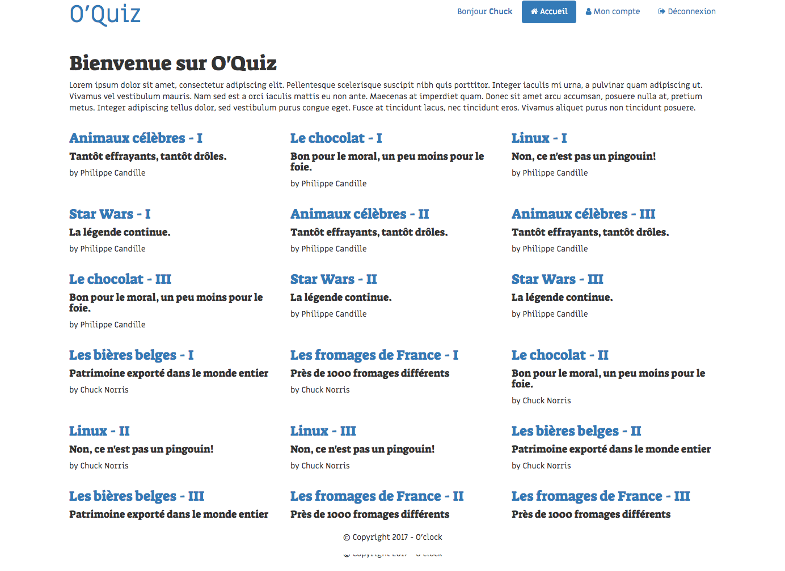

## 1. Page d'accueil
*  pour afficher la liste des quiz disponibles sur le site comme sur la maquette:  
  * Créer le QuizModel: quels attributs pour un quiz? n'oubliez par les getters/setters
    * Ajouter une méthode du modèle qui permet de récupérer tous les quizzes de la BD
  * Compléter la méthode de controller `indexAction`
  * Créez le template de la page d'accueil pour afficher les quiz

* Ajouter la liste des quiz d'un utilisateur à sa page "Mon Compte" (l'objectif ici est de réutiliser le même template pour afficher la liste des quiz que sur la page d'accueil)

  
