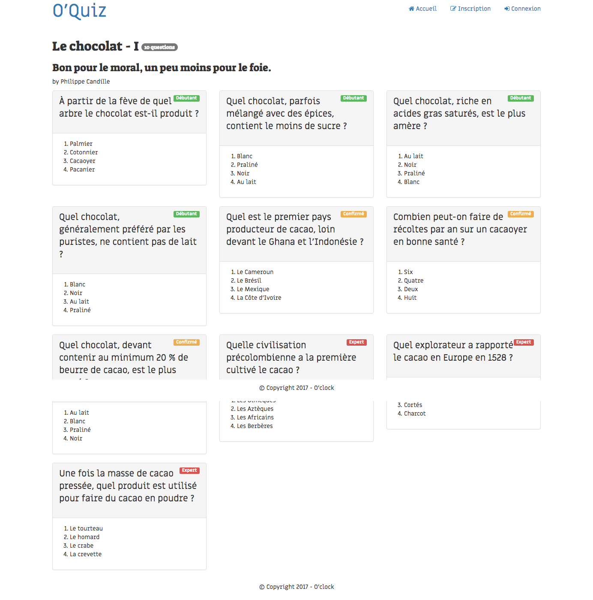

## 2. Consulter un Quiz
* ajouter la route `/quiz/[id]` qui affiche le détail d'un quiz.   
  * paramétrez la route et créer une méthode de controller
  * créer le template `front/quiz.php`
  * dans le QuizModel, créer la méthode qui permet de récupérer un quiz (à partir de son id)
  * créer le QuestionModel : propriétés, getters, setters, puis la méthode qui récupère toutes les questions d'un quiz
  * utiliser ces méthodes dans le controller pour récupérer les infos du quiz et afficher votre vue.

* N'oubliez pas d'ajouter le lien vers cette page, sur chaque titre de quiz, sur la page d'accueil.

* Les 4 propositions doivent être mélangées (c'est à dire pas toujours présentées dans le même ordre) dans la présentation.
  * dans QuestionModel, créer une méthode qui renvoie les propositions mélangées d'une **question**, sous forme d'un tableau. Pour vous aider, vous pouvez par exemple aller examiner la fonction [shuffle()](http://php.net/shuffle).
  * modifier le template: appeler cette méthode pour afficher les propositions mélangées.  

  
